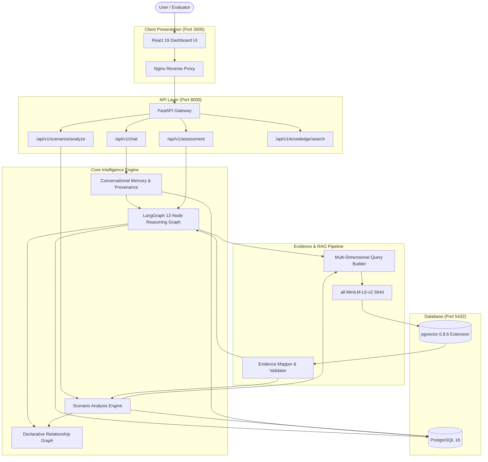
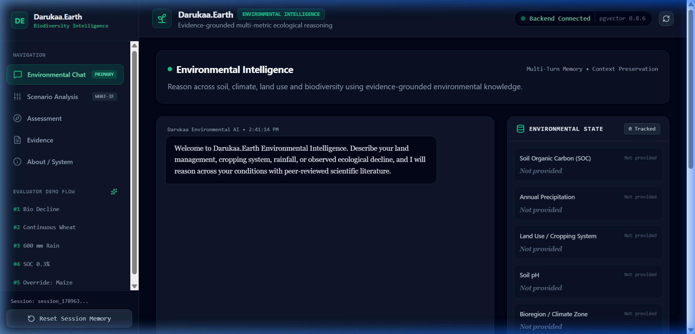
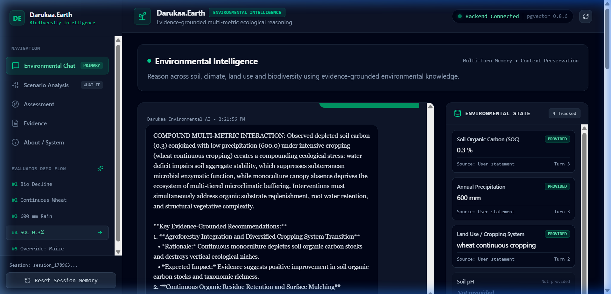
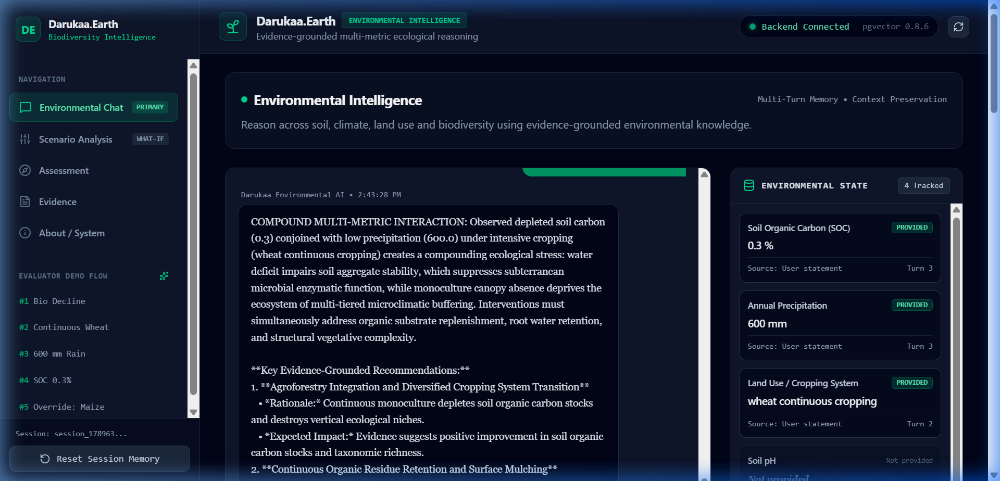
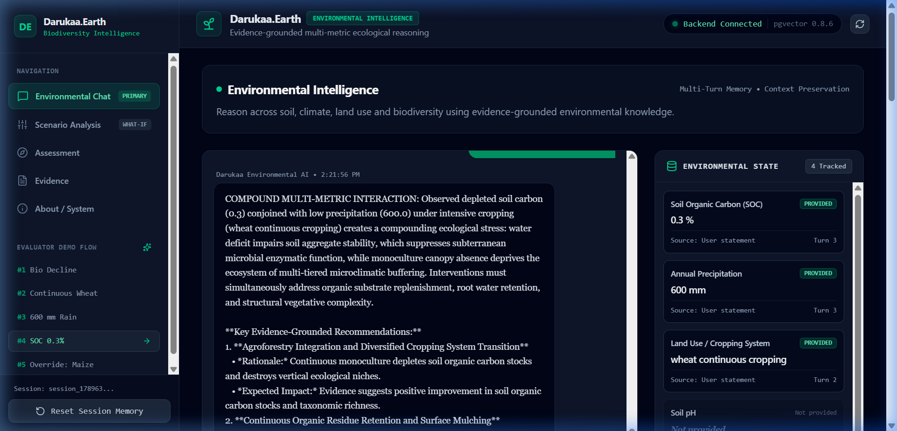
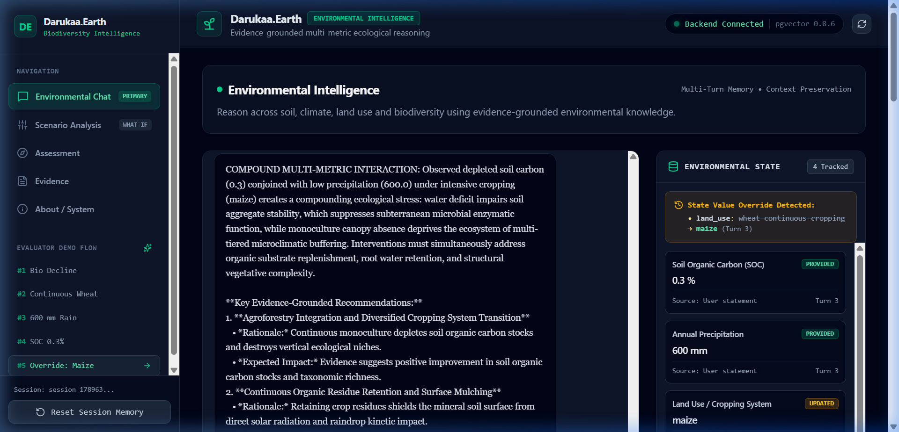
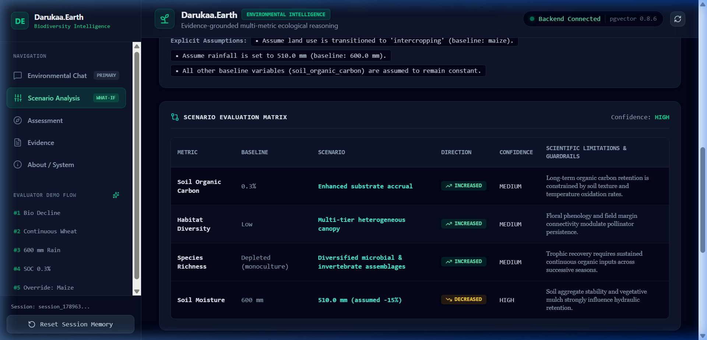

# Darukaa.Earth — AI Biodiversity Intelligence Platform

> Evidence-grounded environmental intelligence for reasoning across soil, climate, land use and biodiversity.

[](https://github.com/darukaa-earth/biodiversity-intelligence/actions/workflows/ci.yml)
[](https://fastapi.tiangolo.com)
[](https://langchain-ai.github.io/langgraph/)
[](https://github.com/pgvector/pgvector)
[](https://react.dev/)
[](https://tailwindcss.com/)
[](LICENSE)

---

## 1. Problem Statement

Ecological restoration and agricultural sustainability require multi-dimensional scientific reasoning across interconnected environmental systems. In practice, ecological decline rarely stems from a single isolated cause:

- **Soil health** (organic carbon, aggregate structure, microbial biomass) directly dictates moisture infiltration and nutrient cycling.
- **Precipitation patterns** determine hydraulic stress and interact with soil organic carbon to govern drought resilience.
- **Land-use practices** (monoculture vs. diversified agroforestry) control vertical habitat niches, soil exposure, and thermal oxidation rates.
- **Biodiversity & habitat fragmentation** reflect the cumulative pressures of human land conversion, chemical pollution, and vegetative cover loss.

Generic generative AI chatbots fail at this problem because they produce ungrounded, uncalibrated generalities, invent quantitative percentage gains without peer-reviewed backing, treat unknown variables as zero or regional averages, and lack stateful multi-variable memory.

**Darukaa.Earth** solves this by enforcing an auditable, evidence-grounded intelligence pipeline where every ecological relationship, recommendation, and scenario projection is anchored in peer-reviewed scientific literature and validated environmental state.

---

## 2. Solution Architecture

Darukaa.Earth is **not** a simple `User → LLM → generic answer` chatbot, nor is it a naive `User → simple RAG → answer` semantic search engine.

It is an **environmental reasoning system** combining structured parameter tracking, deterministic causal heuristics, semantic vector retrieval, and automated evidence validation:

### Environmental Assessment Pipeline
```text
User Query
    ↓
Input Analysis & State Extraction
    ↓
Environmental State Model (Provenance & Status Tracking)
    ↓
Missing Data Detection / Targeted Clarification
    ↓
Multi-Metric Relationship Discovery (Compound Interaction Heuristics)
    ↓
Multi-Dimensional Query Synthesis
    ↓
Semantic Retrieval (PostgreSQL 16 + pgvector)
    ↓
Evidence Mapping & Source Verification (FAO / IPCC DOIs)
    ↓
Recommendation Candidate Generation & Validation
    ↓
Confidence Derivation & Limitations Framing
    ↓
Structured, Explainable Output
```

### What-If Scenario Analysis Pipeline
```text
Baseline State (Immutable Memory)
    ↓
Explicit Scenario Changes (Relative Arithmetic & Categorical Transitions)
    ↓
Scenario State Derivation (Preserving Baseline Immutability)
    ↓
Relationship Analysis & pgvector Evidence Retrieval
    ↓
Scenario Evaluation Matrix (Directions, Confidence, Scientific Guardrails)
```

---

## 3. Key Features

### Environmental Intelligence
- **Soil Metrics**: Soil organic carbon (SOC), pH, volumetric soil moisture with boundary checks.
- **Climate Metrics**: Mean annual precipitation (mm) and temperature (°C) with quantitative and qualitative handling.
- **Land-Use Metrics**: Cropping systems (continuous monoculture, crop rotation, intercropping, agroforestry) and land cover classifications.
- **Biodiversity Indicators**: Species richness counts and qualitative habitat diversity indices.
- **Human Impact**: Agricultural runoff pollution and deforestation status.
- **Geographic Anchoring**: Ecoregion classifications, latitude, and longitude.

### Multi-Metric Reasoning
- **Genuine Compound Interactions**: Evaluates non-linear compound stresses requiring co-occurring environmental variables ($\ge 3$ variables, e.g. depleted SOC + low rainfall + continuous monoculture).
- **Guarded Activation**: Causal rules activate **only** when all required variables are verified in active memory.

### Scientific RAG (PostgreSQL + pgvector)
- **Local Dense Embeddings**: `sentence-transformers/all-MiniLM-L6-v2` (384-dimensional dense vectors with L2 normalization).
- **Cosine Distance Scanning**: Native pgvector `<=>` index operator.
- **Multi-Factor Scoring**: Combines semantic similarity ($40\%$), metadata relevance ($25\%$), relationship alignment ($20\%$), and source authenticity ($15\%$).

### Conversational Memory & Provenance
- **Persistent State Tracking**: Context maintained across multi-turn dialogues with explicit turn provenance (`Source: User statement • Turn X`).
- **State Value Overrides**: Automatically detects and logs explicit parameter updates (e.g. `wheat continuous cropping → maize`).
- **Honest Missing Data**: Unmeasured parameters are explicitly shown as `Not provided` / `unknown`. Missing variables are **never** coerced to `0`, `0.0`, or statistical averages.
- **Targeted Clarification**: Asks focused, click-to-answer questions when critical decision metrics are missing.

### Evidence-Grounded Recommendations
Every generated recommendation includes:
- **Action**: Concrete ecological or agronomic intervention.
- **Why**: Mechanistic scientific rationale.
- **Impacted Metrics**: Specific ecological variables influenced.
- **Time Horizon**: Short-term ($0-1$ yr), medium-term ($1-3$ yr), and long-term ($3-7+$ yr) qualitative projections.
- **Evidence Trace**: Direct links to supporting chunks, source organizations, and DOIs.
- **Limitations**: Real-world agronomic and edaphic caveats.
- **Confidence**: Categorical score (`HIGH`, `MEDIUM`, `LOW`, `INSUFFICIENT`) reflecting input completeness and evidence density.

### What-If Scenario Engine
- **Relative Changes**: Computes deterministic arithmetic transitions (e.g. -15% rainfall from 600 mm $\to$ 510 mm).
- **Categorical Shifts**: Models land-use transitions (e.g. wheat monoculture $\to$ intercropping).
- **Baseline Preservation**: Baseline parameters remain immutable.
- **Evidence-Supported Synergies & Trade-offs**: Discloses mutually reinforcing interactions and potential agronomic tensions without generative hallucination.

---

## 4. System Architecture



---

## 5. RAG Architecture

```text
Scientific Document (PDF / Markdown / TXT)
                    ↓
Document Loader (Structured Header Parsing)
                    ↓
Section-Aware Structural Chunking (Preserving Tables & Sections)
                    ↓
Metadata Tagging (Variables: SOC, Rainfall; Topics: Soil, Agroecology)
                    ↓
Embedding Service (sentence-transformers/all-MiniLM-L6-v2, 384d)
                    ↓
PostgreSQL 16 + pgvector Table (knowledge_chunks)
                    ↓
Cosine Distance Semantic Retrieval (1.0 - (embedding <=> query_vector))
                    ↓
Multi-Factor Evidence Scoring Formula (Threshold >= 0.40)
                    ↓
Auditable Evidence Citation in Output
```

- **Embedding Model**: `sentence-transformers/all-MiniLM-L6-v2` (default, configurable via `EMBEDDING_MODEL` in `.env`).
- **Vector Dimension**: `384` (configurable via `EMBEDDING_DIMENSION`).

---

## 6. Verified Knowledge Sources

Darukaa.Earth indexes an audited, curated scientific corpus comprising verified scientific and technical sources:

1. **Food and Agriculture Organization of the United Nations (FAO)**
   - *State of Knowledge of Soil Biodiversity: Status, Challenges and Potentialities* (2020)
   - **DOI**: [10.4060/cb1924en](https://doi.org/10.4060/cb1924en)
   - *Focus*: Soil organic carbon dynamics, subterranean food webs, microbial enzymatic resilience, and monoculture degradation.
2. **Intergovernmental Panel on Climate Change (IPCC)**
   - *Special Report on Climate Change and Land: Chapter 4 — Land Degradation* (2019)
   - **DOI**: [10.1017/9781009157988.006](https://doi.org/10.1017/9781009157988.006)
   - *Focus*: Compounding drought stress, thermal soil oxidation, vegetative canopy buffering, and erosion mechanics.

> **Integrity Note**: The active corpus is intentionally curated. The previously evaluated Torralba agroforestry dataset was identified as geographically mismatched and is **strictly excluded** from the active database registry.

---

## 7. Scientific Grounding & Safety Guardrails

- **Zero Synthetic Quantifications**: The system will **never** fabricate numerical percentage claims (e.g. claiming a cover crop will increase species richness by $+28.4\%$) unless directly quoted from retrieved evidence.
- **Empirical Direction vs. Magnitude**: If empirical magnitude cannot be estimated without on-site soil testing, the system explicitly reports:
  > *"Direction supported; site-specific magnitude cannot be estimated from available evidence without local soil testing."*
- **Unknown != Zero**: Unmeasured variables remain `None` / `unknown` and are never assumed or converted into zeroes or averages.
- **Immutable Historical Evidence**: Historical assistant conversational outputs are never fed back into the knowledge base as evidence.
- **Guarded Relationship Preconditions**: Causal relationships activate **only** when all required variables are verified in active context.
- **Categorical Confidence**: Confidence reflects evidence density and data completeness (`HIGH`, `MEDIUM`, `LOW`, `INSUFFICIENT`), never a statistical probability of universal scientific certainty.

---

## 8. Canonical Conversational Example

### Multi-Turn Dialogue Flow
1. **User (Turn 1)**: *"My farm has declining biodiversity."*
   - **System**: Status `clarification_needed`. Requests cropping system, rainfall, and SOC. Zero hallucinated parameters.
2. **User (Turn 2)**: *"I grow wheat continuously."*
   - **System**: Records `land_use: wheat continuous cropping` (`source: user_statement, turn_id: 2`).
3. **User (Turn 3)**: *"Annual rainfall is around 600 mm."*
   - **System**: Records `rainfall: 600.0 mm` (`source: user_statement, turn_id: 3`).
4. **User (Turn 4)**: *"My soil organic carbon is 0.3%."*
   - **System**: Environmental State reaches 3 co-occurring variables:
     - `soil_organic_carbon = 0.3%`
     - `rainfall = 600.0 mm`
     - `land_use = wheat continuous cropping`
   - **Multi-Metric Reasoning**: Activates `soc_rainfall_monoculture_stress` compound interaction.
   - **Evidence Grounding**: Retrieves 4 FAO and IPCC chunks (`DOI: 10.4060/cb1924en`, `DOI: 10.1017/9781009157988.006`).
   - **Recommendations**: Proposes *Agroforestry Integration* and *Continuous Residue Mulching* with explicit time horizons and limitations.
5. **User (Turn 5)**: *"Actually, I switched from wheat to maize this year."*
   - **System**: Alerts `State Value Override Detected: land_use: wheat continuous cropping → maize (Turn 3)`. Automatically updates multi-metric reasoning to reflect maize while preserving SOC and rainfall.

---

## 9. Scenario Analysis Example

### What-If Simulation
- **Baseline**: SOC = 0.3%, Rainfall = 600.0 mm, Land Use = wheat monoculture.
- **Scenario Delta**: Rainfall decreases by 15%, Land Use transitions to intercropping.

### Verified Resolution
- **Rainfall**: $600.0\text{ mm} \longrightarrow 510.0\text{ mm}$ (Deterministic arithmetic relative change).
- **Land Use**: `wheat monoculture` $\longrightarrow$ `intercropping` (Categorical transition).
- **Baseline Preserved**: Baseline SOC (0.3%) and Rainfall (600.0 mm) remain unchanged in memory.
- **Assumptions**: Explicitly logged: `"Assume rainfall decreases by 15% relative to baseline (600.0 mm → 510.0 mm)."`
- **Evaluation Matrix**:
  - `soil_organic_carbon`: Direction `increased`, Confidence `medium`, Limitations stated.
  - `soil_moisture`: Direction `decreased`, Confidence `high`, Limitations stated.
  - `species_richness`: Direction `increased`, Confidence `medium`, Limitations stated.
- **Synergies**: Identified mutual reinforcement between above-ground canopy diversity and subterranean fungal webs (FAO 2020).

---

## 10. Database Architecture

The PostgreSQL 16 database (`darukaa_earth`) consists of 10 tables:

| Table | Purpose |
| :--- | :--- |
| `users` | User accounts and preferences. |
| `conversations` | Dialogue sessions with persistent metadata. |
| `messages` | Turn-by-turn conversational history with extracted variable snapshots. |
| `environmental_assessments` | Structured assessment outputs, classifications, and syntheses. |
| `knowledge_documents` | Scientific source documents (author org, title, year, DOI, URL). |
| `knowledge_chunks` | Text chunks with 384-dimensional pgvector embeddings and topic tags. |
| `evidence` | Qualified evidence citations linked to assessment runs. |
| `recommendations` | Interventions with time horizons, confidence scores, and limitations. |
| `recommendation_evidence` | Join table linking recommendations to supporting knowledge chunks. |
| `scenarios` | Saved scenario simulations and evaluation matrices. |

---

## 11. API Reference

Interactive Swagger documentation is available at [http://localhost:8000/docs](http://localhost:8000/docs).

| Method | Endpoint | Description |
| :--- | :--- | :--- |
| `GET` | `/health` | Service health check (`{"status": "ok"}`). |
| `GET` | `/api/v1/health` | Versioned API health check. |
| `POST` | `/api/v1/chat` | Multi-turn conversational intelligence with context extraction. |
| `POST` | `/api/v1/scenarios/analyze` | What-If scenario simulation against baseline parameters. |
| `POST` | `/api/v1/assessment` | Direct parameter-level 12-node LangGraph assessment. |
| `POST` | `/api/v1/knowledge/search` | Semantic cosine vector search over scientific chunks. |

*Detailed request and response schemas are provided in [docs/API.md](docs/API.md).*

---

## 12. Local Setup & Quickstart

### Prerequisites
- [Docker](https://docs.docker.com/get-docker/) (v24.0+)
- [Docker Compose](https://docs.docker.com/compose/) (v2.20+)
- Git

### Installation
```bash
# 1. Clone repository
git clone https://github.com/mdosama8435/Darukaa-Biodiversity-Chatbot.git
cd Darukaa-Biodiversity-Chatbot

# 2. Configure environment (optional, defaults provided)
cp .env.example .env

# 3. Build and launch containerized services
docker compose up -d --build
```

### Verification
```bash
# Check container status
docker compose ps

# Verify backend health
curl http://localhost:8000/health
```

### Access Ports
- **Frontend Dashboard**: [http://localhost:3001](http://localhost:3001)
- **Backend API**: [http://localhost:8000](http://localhost:8000)
- **Swagger Documentation**: [http://localhost:8000/docs](http://localhost:8000/docs)
- **PostgreSQL Database**: `localhost:5432` (`user: darukaa`, `db: darukaa_earth`)

---

## 13. Testing & Verification

All test suites verify software correctness against live containerized dependencies without mocks or fake fallbacks.

```bash
# Run backend pytest suite (91 tests across 11 test modules)
docker compose exec backend pytest -v

# Run frontend production build
npm --prefix frontend run build
```

### Verified Acceptance Status:
- **Backend Tests**: **102 passed, 0 failed, 1 warning in 29.1s** (100% pass rate).
- **Frontend Production Build**: **Exit code 0**, 1,880 modules transformed in **1.13s**.
- **Browser Acceptance Demo**: 20-step canonical demonstration verified live with zero console errors.

*Full test breakdown and acceptance methodology available in [docs/TESTING.md](docs/TESTING.md).*

---

## 14. Technology Stack

- **Backend**: Python 3.11, FastAPI, Pydantic v2, LangChain, LangGraph, SQLAlchemy 2.0.
- **Machine Learning & RAG**: `sentence-transformers/all-MiniLM-L6-v2` (384-dimensional dense vectors), PyTorch, HuggingFace Hub.
- **Database**: PostgreSQL 16, `pgvector` extension.
- **Frontend**: React 19, Vite 8, Tailwind CSS v4, Lucide React icons.
- **Containerization & Web Server**: Docker, Docker Compose, Nginx Alpine.
- **CI/CD**: GitHub Actions (`.github/workflows/ci.yml`).

---

## 15. Engineering Decisions

1. **PostgreSQL + pgvector vs. Standalone Vector DBs**: PostgreSQL provides ACID transaction guarantees, relational join capabilities between recommendations and source documents, and unified deployment without managing separate vector infrastructure.
2. **Separation of State from Text Chunks**: Environmental variables are stored in strongly-typed relational schemas with provenance rather than concatenated into unstructured embeddings, ensuring mathematical precision during scenario arithmetic.
3. **Declarative Relationship Graph vs. Pure Prompting**: Causal heuristics are defined in code with mandatory variable preconditions, guaranteeing that the model cannot hallucinate non-existent ecological interactions.
4. **Automated Evidence Validation Filter**: Candidate recommendations must satisfy a multi-factor score ($\ge 0.40$) against verified institutional DOIs, blocking generic or ungrounded generative advice.

---

## 16. Screenshots

Visual artifacts captured during live evaluator testing (available in `docs/screenshots/`):

| View | Screenshot |
| :--- | :--- |
| **Main Dashboard Shell** |  |
| **Targeted Clarification Flow** |  |
| **Environmental Context Panel** |  |
| **Multi-Metric Reasoning** |  |
| **Scientific Evidence Citations** |  |
| **Recommendation & Override** |  |
| **What-If Scenario Evaluation** |  |

---

## 17. Limitations & Boundaries

1. **Curated Scientific Corpus**: The active corpus is currently focused on consensus reports from FAO (2020) and IPCC (2019). While highly authoritative for soil organic carbon, drought stress, and monoculture transitions, broader ecological topics require expanding the indexed corpus.
2. **Empirical Magnitude Constraints**: The system reports scientifically supported directions of change but does not manufacture exact quantitative percentage increments without on-site soil testing and local agronomic calibration.
3. **Vector Similarity vs. Truth**: Vector distance measures semantic alignment with published literature; it does not replace professional agronomic field verification.
4. **Production Authentication**: User authentication is implemented at the schema level; enterprise SSO/OAuth2 deployment requires additional external identity provider configuration.

---

## 18. Future Work *(NOT CURRENTLY IMPLEMENTED)*

- Integration of high-resolution satellite remote sensing layers (Sentinel-2 NDVI, soil moisture radar).
- Automated expansion of the peer-reviewed corpus via automated DOI harvesting and validation.
- Calibrated spatial biogeochemical models (e.g. DayCent, RothC) for regional quantitative SOC accrual modeling.
- Native mobile client support for offline field data collection.

---

## 19. Detailed Technical Documentation

- [System Architecture & Specifications](docs/ARCHITECTURE.md)
- [Scientific Grounding Methodology & Evidence Rules](docs/SCIENTIFIC_GROUNDING.md)
- [API Reference & Request Schemas](docs/API.md)
- [Testing & Verification Guide](docs/TESTING.md)

---

## 20. License

This project is licensed under the Apache License 2.0. See the [LICENSE](LICENSE) file for details.
