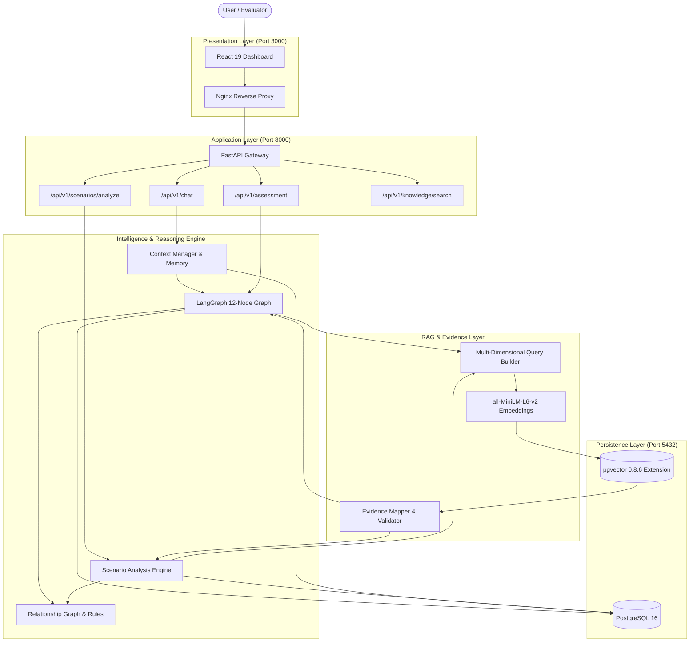
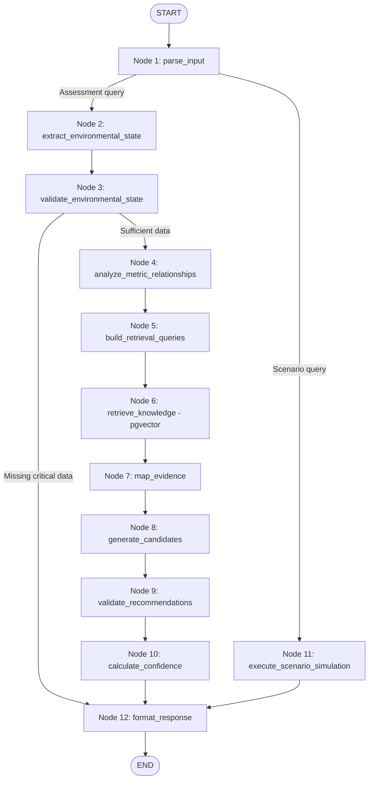

# Darukaa.Earth — System Architecture & Technical Specifications

## 1. System Overview

**Darukaa.Earth** is an evidence-grounded AI environmental intelligence platform designed to evaluate compound ecological degradation across interacting agricultural, climatic, and edaphic dimensions. Rather than operating as an unconstrained conversational chatbot or a naive document search tool, Darukaa implements an auditable, multi-stage reasoning pipeline:

$$\text{Environmental State} \longrightarrow \text{Relationship Activation} \longrightarrow \text{Semantic Vector Retrieval} \longrightarrow \text{Evidence Validation} \longrightarrow \text{Contextual Recommendation} \longrightarrow \text{What-If Scenario Simulation}$$

### Core Architectural Principles
- **No Hallucinated Scientific Claims**: All scientific interventions, mechanisms, and assertions must be grounded in peer-reviewed literature indexed in PostgreSQL via pgvector.
- **Explicit Causal Heuristics**: Causal relationships between environmental variables (e.g. soil organic carbon, annual rainfall, cropping system) are defined declaratively with strict variable pre-conditions, preventing generative hallucinations.
- **Deterministic What-If Simulation**: Scenario deltas (e.g. -15% rainfall reduction) perform explicit arithmetic transitions relative to baseline state without modifying or losing baseline measurements.
- **Auditable Provenance**: Every environmental variable tracks its source (user statement, inferred heuristic, or assumed scenario), turn identifier, and update timestamp.

---

## 2. Component Architecture



---

## 3. Request Lifecycle

### A. Conversational Assessment Flow (`POST /api/v1/chat`)
1. **Intake**: Incoming message received with `conversation_id`.
2. **Turn Extraction**: `ConversationTurnProcessor` extracts known variables (SOC, rainfall, land use, pH, etc.) via deterministic regex and contextual matchers.
3. **Memory Update**: `ContextManager` loads historical context from PostgreSQL (`conversations` and `messages`), updates existing variables, and detects overrides (e.g. wheat $\to$ maize).
4. **Clarification Check**: If critical decision variables (SOC, rainfall, land use) are missing, execution halts early, setting `status: clarification_needed` and returning targeted, topic-relevant questions.
5. **Reasoning Graph Execution**: If sufficient data exists, state is passed to `app_graph` (LangGraph).
6. **Multi-Metric Relationship Discovery**: `EnvironmentalRelationshipAnalyzer` tests preconditions against active variables.
7. **Query Synthesis**: `MultiDimensionalQueryBuilder` crafts compound search queries based on active variables and relationships.
8. **Semantic Retrieval**: Queries are embedded via `sentence-transformers/all-MiniLM-L6-v2` (384 dimensions) and matched using cosine distance against `knowledge_chunks`.
9. **Evidence Validation**: Retrieved chunks are mapped to active relationships; chunks with relevance $<0.40$ or unverified source metadata are discarded.
10. **Candidate Generation & Ranking**: Context-specific recommendations are constructed and scored against evidence coverage and data completeness.
11. **Persistence & Return**: Output formatted and saved to database; response emitted to user.

### B. What-If Scenario Flow (`POST /api/v1/scenarios/analyze`)
1. **Intake**: Natural language inquiry (e.g. *"What if rainfall decreases by 15%?"*) or structured deltas paired with baseline state.
2. **Parsing & Delta Resolution**: `ScenarioParser` resolves relative changes (e.g. -15% of 600 mm = 510 mm) or categorical changes (wheat $\to$ intercropping).
3. **State Construction**: `ScenarioStateBuilder` duplicates baseline state, applies changes, and generates explicit assumption statements. Baseline parameters remain immutable.
4. **Comparative Analysis**: `ScenarioAnalysisEngine` evaluates the delta against the relationship graph, executes semantic search against pgvector, and derives synergies, trade-offs, and an evaluation matrix.

---

## 4. Environmental State Model

Environmental state is represented by structured Pydantic models in `backend/app/models/environmental.py`:

```python
class EnvironmentalData(BaseModel):
    soil: SoilData              # soil_organic_carbon, soil_ph, soil_moisture
    climate: ClimateData        # temperature, rainfall
    land: LandData              # land_use, land_cover
    biodiversity: BiodiversityData  # species_richness, habitat_diversity
    human_impact: HumanImpactData  # pollution, deforestation
    location: LocationData      # region, latitude, longitude
```

### Provenance Tracking
Every variable in conversational memory is wrapped in a `VariableProvenance` record:
- `variable`: Canonical variable key (e.g. `soil_organic_carbon`).
- `value`: Typed value (`float`, `int`, or `str`).
- `unit`: Measurement unit (`%`, `mm`, `°C`).
- `source`: `user_statement`, `inferred`, or `assumed_scenario`.
- `turn_id`: Conversation turn index where value was introduced or updated.
- `status`: `provided`, `unknown`, `inferred`, or `updated`.

---

## 5. LangGraph 12-Node Reasoning Pipeline

The environmental reasoning engine is compiled as a stateful `StateGraph` in `backend/app/agents/graph.py`:



---

## 6. Relationship Graph & Causal Heuristics

Declarative rules in `backend/app/environmental/relationships.py` define ecological interactions. Each relationship specifies:
- `relationship_id`: Unique identifier.
- `mechanism`: Biological or physical explanation.
- `variables`: Participating environmental metrics.
- `required_variables`: Mandatory preconditions. A relationship will **never** activate unless all required variables are present in active state.

### Multi-Metric Grounding
Compound interactions require $\ge 3$ co-occurring variables (e.g. `soc_rainfall_monoculture_stress` requires `soil_organic_carbon`, `rainfall`, and `land_use`).

---

## 7. RAG Pipeline & Vector Database

- **Embedding Model**: `sentence-transformers/all-MiniLM-L6-v2` (Local HuggingFace model running inside container; 384 dimensions, normalized L2 vectors).
- **PostgreSQL Vector Extension**: `pgvector 0.8.6` on PostgreSQL 16.
- **Distance Metric**: Cosine distance (`<=>` operator).
- **Chunking Strategy**: Section-aware structural chunking preserving document hierarchy, publication metadata, DOIs, and variable tags.
- **Active Curated Corpus**:
  1. FAO (2020) — *State of Knowledge of Soil Biodiversity* (`DOI: 10.4060/cb1924en`).
  2. IPCC (2019) — *Special Report on Climate Change and Land: Chapter 4 — Land Degradation* (`DOI: 10.1017/9781009157988.006`).

---

## 8. Database Architecture

The PostgreSQL schema (`darukaa_earth`) consists of 10 tables:

| Table | Role |
| :--- | :--- |
| `users` | User accounts and preferences. |
| `conversations` | Dialogue sessions with persistent metadata. |
| `messages` | Turn-by-turn conversational messages and extracted state snapshots. |
| `environmental_assessments` | Structured assessment outputs, classifications, and syntheses. |
| `knowledge_documents` | Scientific source documents (author org, title, year, DOI, URL). |
| `knowledge_chunks` | Text chunks with 384-dimensional pgvector embeddings and topic tags. |
| `evidence` | Qualified evidence citations linked to assessment runs. |
| `recommendations` | Generated interventions with time horizons and confidence scores. |
| `recommendation_evidence` | Join table linking recommendations to supporting knowledge chunks. |
| `scenarios` | Saved scenario simulations and evaluation matrices. |

---

## 9. Error Handling & Guardrails

- **Zero Silent Fallbacks**: If the database or vector extension is unavailable, queries raise an explicit HTTP 503 or RuntimeError; the system never returns low-confidence fake recommendations.
- **Input Validation**: Out-of-bounds parameters (e.g. soil pH $>14$) trigger HTTP 422 validation errors.
- **Quantitative Claim Guard**: The recommendation validator rejects unsupported numerical claims (e.g. "+25% species richness") unless explicitly confirmed in retrieved text excerpts.
